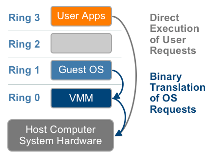

## KVM Gvt-g PCIe Passthrough

## 前置知识

### 虚拟化分类
- 平台虚拟化（Platform Virtualization），针对计算机和操作系统的虚拟化，即产生vm。
- 资源虚拟化（Resource Virtualization），针对特定的系统资源的虚拟化，比如内存虚拟化、存储虚拟化、网络资源虚拟化等。
- 应用程序虚拟化（Application Virtualization），包括仿真、模拟、解释技术（java虚拟机jvm）等

### 虚拟化技术
1. 使用二进制翻译的全虚拟化（Full Virtualization using Binary Translation）
  
2. 操作系统辅助或半虚拟化（OS Assisted Virtualization or Paravirtualization）
  
3. 硬件辅助的虚拟化（Hardware Assisted Virtualization）  
  
Intel的VT-x和AMD的AMD-V技术提供了新的CPU特性，使得VMM可以运行在ring0模式之下

### KVM
基于内核的虚拟机 Kernel-based Virtual Machine（KVM）是一种内建于 Linux® 中的开源虚拟化技术。具体而言，KVM 可将 Linux 内核转化为虚拟机监控器，使主机计算机能够运行多个隔离的虚拟环境，即虚拟客户机或虚拟机（VM）。KVM需要支持硬件虚拟化（如Intel-VT）拓展特性的处理器。每个虚拟机都像普通的 Linux 进程一样运行，由标准的 Linux 调度程序进行调度。

## 参考
https://wiki.archlinux.org/title/PCI_passthrough_via_OVMF_(%E7%AE%80%E4%BD%93%E4%B8%AD%E6%96%87)
https://wiki.archlinux.org/title/Intel_GVT-g
https://www.redhat.com/zh/topics/virtualization/what-is-KVM
https://bbs.huaweicloud.com/forum/thread-78816-1-1.
https://www.vmware.com/content/dam/digitalmarketing/vmware/en/pdf/techpaper/VMware_paravirtualization.pdf

